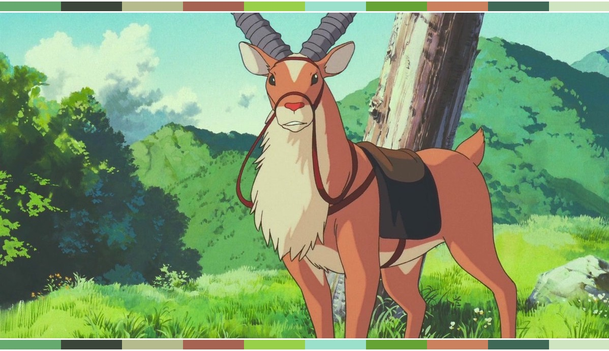

# Color Palette Extraction

This script calculates the dominant colors of an image by using k-means clustering, and returns the obtained color palette.

## Instructions

*NEED TO WRITE THE INSTRUCTIONS HERE*

##  Dependencies

* [cv2](https://opencv-python-tutroals.readthedocs.io/en/latest/py_tutorials/py_tutorials.html)
* [Pillow](https://pillow.readthedocs.io/en/stable/)
* [numpy](https://numpy.org/)
* [sklearn](https://scikit-learn.org/stable/)

## Still To Do

* Export the palette independently from the image
* Add white sidebars

 

[Héctor M. Sánchez C.](https://chipdelmal.github.io/)
