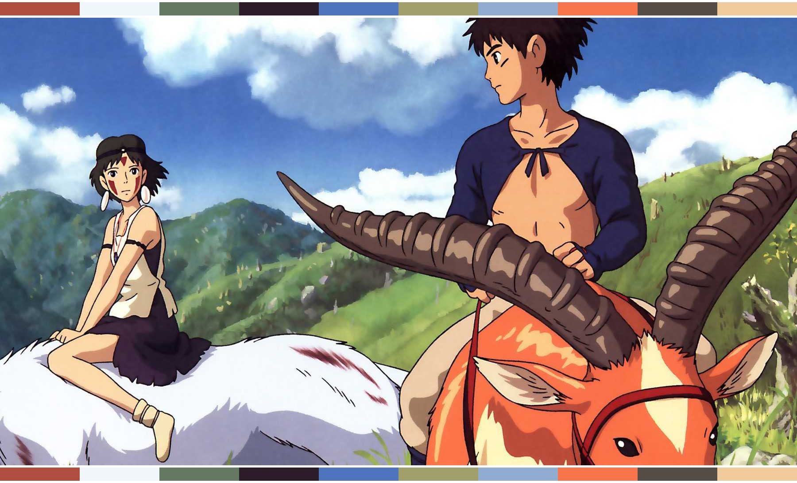
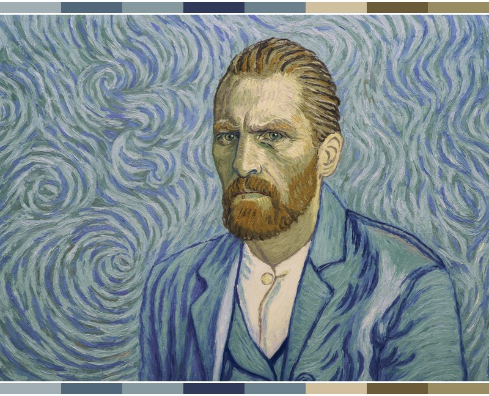
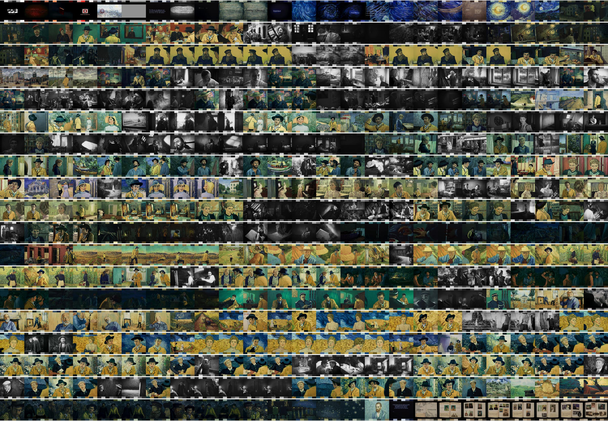

# Color Palette Extraction

This script calculates the dominant colors of an image by using k-means clustering, and returns the obtained color palette. It can be used in batch to generate the grid of the changes in color palettes in a movie (provided that we have the frames which can be obtained with ffmpeg).

## Instructions

For now, I'm running my scripts from [Atom](https://atom.io/) with [Hydrogen](https://atom.io/packages/hydrogen), so the easiest way to run them is to edit the inputs directly in the first lines of the code (clearly commented), and run the whole script. I hope to have some time in the future to do a proper terminal wrapper.

### Easy use (batch)

1. Place your images in the `./in/` folder.
2. Run [`mainBatch.py`](./mainBatch.py).
3. All the processed files will be exported to the `./out/` folder.

### Advanced use

The main files are:

* **[mainBatch.py](https://github.com/Chipdelmal/colorPaletteExtractor/blob/master/mainBatch.py)**: This script should be used to get all the images within a folder, process them, and export them into another folder.
* **[mainSingle.py](https://github.com/Chipdelmal/colorPaletteExtractor/blob/master/mainSingle.py)**: This is meant to be used for a single image to export the frame, swatch, and color codes (hex and rgb) into the output folder.

To change style parameters:

* **CLST_NUM**: Defines the number of dominant colors to detect.
* **MAX_ITER**: Sets the maximum number of iterations for the _k-means_ algorithm.
* **BAR_HEIGHT**: Defines the height of the dominant colors bar as a proportion of the height of the input image.
* **BUF_HEIGHT**: Sets the buffer zone as a proportion of the height of the input image.
* **BUF_COLOR**: Sets the color of the buffer zone around the image.

##  Dependencies

The script needs the following dependencies to be installed either in the base installation or a virtual environment: [cv2](https://opencv-python-tutroals.readthedocs.io/en/latest/py_tutorials/py_tutorials.html), [Pillow](https://pillow.readthedocs.io/en/stable/), [numpy](https://numpy.org/), [sklearn](https://scikit-learn.org/stable/).

## Still To Do

* Overlay the hex code to the swatch
* Translate the grid generator from _Mathematica_ to _Python_.
* Link to the repo with the frames exporter.

 

[Héctor M. Sánchez C.](https://chipdelmal.github.io/)
